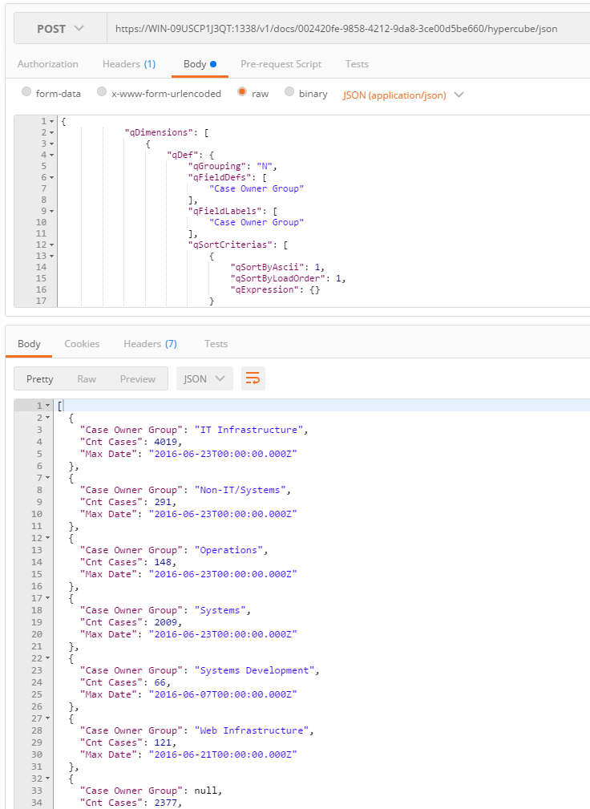
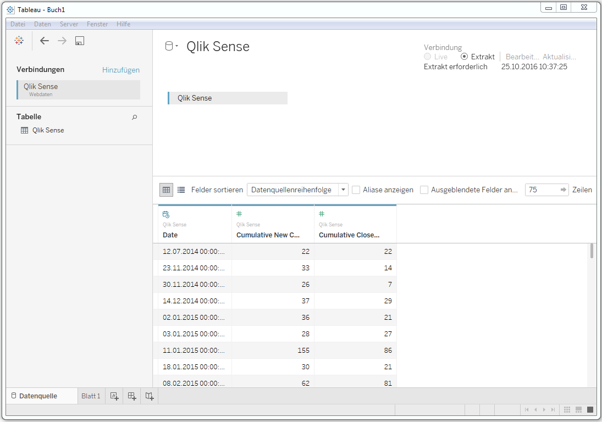

## q-risotto

**Q**lik **R**EST **I**n **S**ense (**otto**) - a RESTful Engine API wrapper

Inspired by project [chartcacher] by [Alexander Karlsson]. 

[chartcacher]: https://github.com/mindspank/chartcacher
[Alexander Karlsson]: https://github.com/mindspank


The intention was to provide an easy access to apps, objects and its data on a Qlik Sense server thru a REST API to integrate with other systems.

The development state of this API is at the very beginning and highly incomplete, so more or less raw and unground. But see yourself.

### Endpoints

See also: [routes.js](./routes/routes.js)

GET **/v1/docs** - all docs on server, returns getDocList().**qDocList**

GET **/v1/doc/{docId}** - app layout, returns getAppLayout().**qLayout**

GET **/v1/doc/{docId}/objects** - all objects of app, returns getAllInfos().**qInfos**

GET **/v1/doc/{docId}/object/{objId}** - object layout, returns getLayout().**qLayout**

GET **/v1/doc/{docId}/object/{objId}/layout** - layout data, returns getLayout().**qLayout** depending on object type it contains qHyperCube and qDataPages

GET **/v1/doc/{docId}/object/{objId}/data** - object data, returns either getLayout().**qHyperCube/qListObject** depending on object type chart/listbox, not data for pivot tables

GET **/v1/doc/{docId}/object/{objId}/pivotdata** - object data, returns getLayout().**qPivotDataPages** for pivot tables

GET **/v1/doc/{docId}/object/{objId}/layers** - object data, returns getLayout().**layers** for maps

POST **/v1/doc/{docId}/hypercube** - give a qHyperCubeDef JSON as payload (request body) and get back the evaluated getLayout().**qHyperCube**

POST **/v1/doc/{docId}/hypercube/json** - give a qHyperCubeDef JSON as payload (request body) and get back the evaluated getLayout().qHyperCube transformed into a **JSON collection** of data rows (eg. easy to use with Qlik REST Connector), date and timestamps are delivered in UTC-time

### Static Resources

GET /**wdc** - Tableau WDC to connect q-risotto endpoint /v1/doc/{docId}/hypercube/json

### Installing

`cd src`

`npm install`

### Qlik Sense Service Dispatcher Integration

* Copy the files manually with admin priviliges into  
```C:\Program Files\Qlik\Sense\ServiceDispatcher\Node\q-risotto\```  

* Then append the following configuration options to  
```C:\Program Files\Qlik\Sense\ServiceDispatcher\services.conf```  
This will let the Service Dispatcher know how to run the module, this step has to be re-applied in an upgrade of Qlik Sense Server.

```
[q-risotto]
Identity=Qlik.q-risotto
Enabled=true
DisplayName=q-risotto
ExecType=nodejs
ExePath=Node\node.exe
Script=Node\q-risotto\server.js

[q-risotto.parameters]
```
### Usage

See [config.js](./config.js) for configurations.

Start on Qlik Sense server with `npm start` or integrate into Qlik Sense ServiceDispatcher.

Navigate with browser or other tools to `https://<qlik sense server name>:1338/<endpoint>`

#### Postman

Test q-risotto API calls with Postman:


#### QlikView

Use QlikView with the Qlik REST Connector to retrieve data from Qlik Sense:


#### Tableau

Use q-risotto WDC with Tableau to retrieve data from Qlik Sense:




#### R Integration

Use q-risotto with R and retrieve data from Qlik Sense, there will be an 
R convenience package soon to wrap q-risotto and complex Qlik structs like qHypoerCubeDef:


### Author

**Ralf Becher**

+ [irregular.bi](http://irregular.bi)
* [twitter/irregularbi](http://twitter.com/irregularbi)
* [github.com/ralfbecher](http://github.com/ralfbecher)

### License

Copyright © 2016 Ralf Becher

Released under the MIT license.

***
